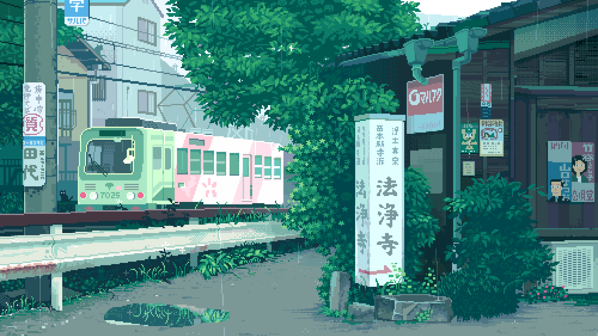
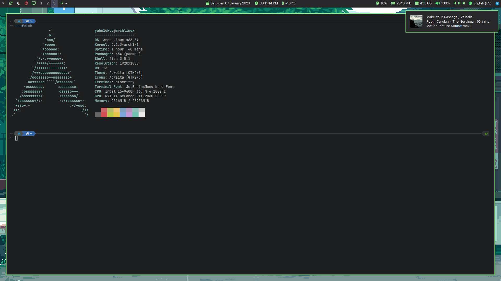

# My ArchLinux i3gaps Configuration

## Fonts

|Font|AUR|
|-|-|
|JetBrainsMono Nerd Font|nerd-fonts-jetbrains-mono|
|SF Pro|apple-fonts|
|Noto|noto-fonts-cjk noto-fonts-emoji noto-fonts|
|Font Awesome|ttf-font-awesome|

## Wallpaper

## Screenshot

